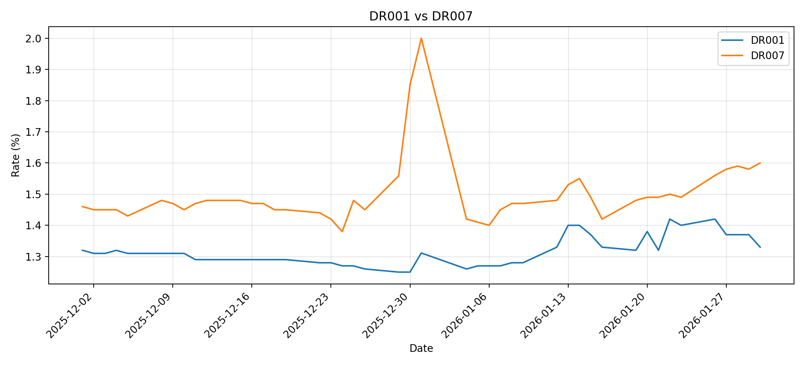
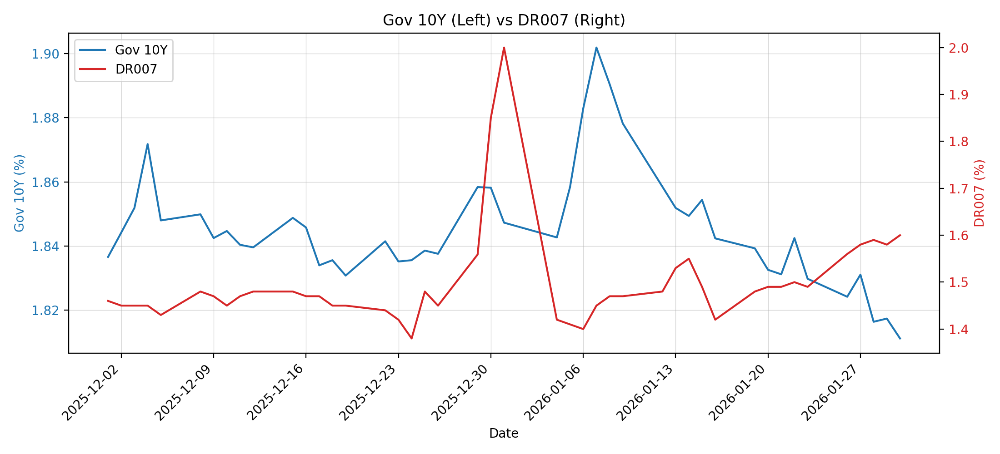
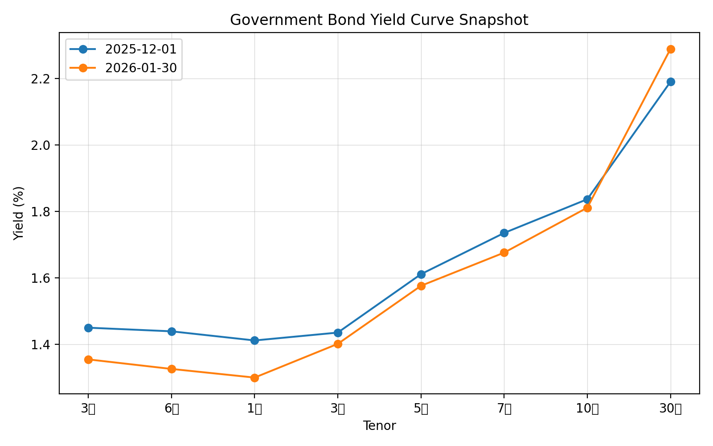
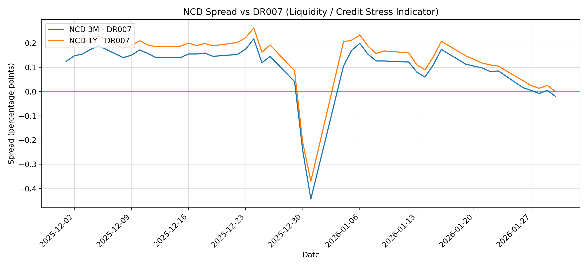
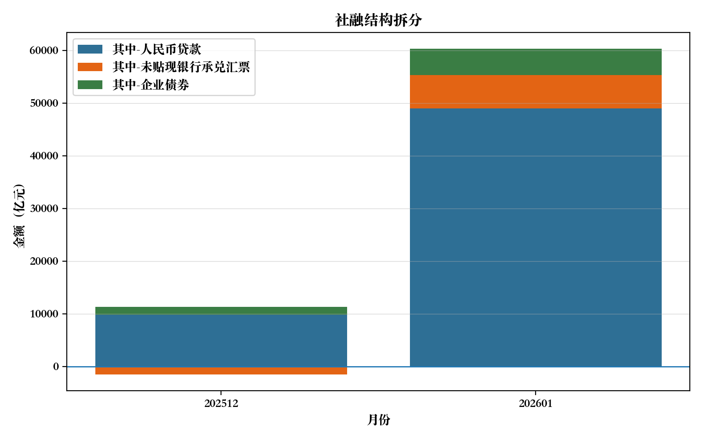
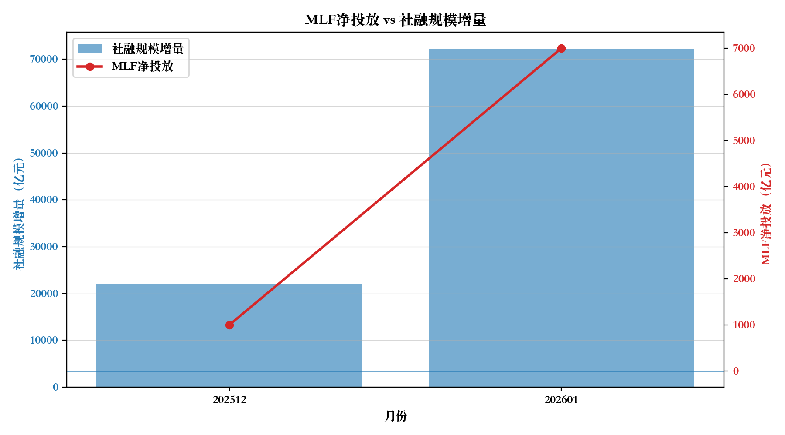
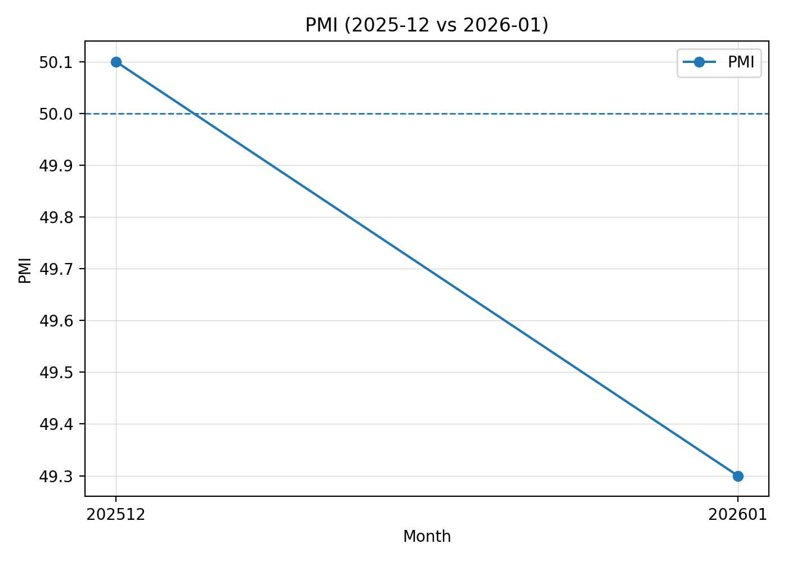
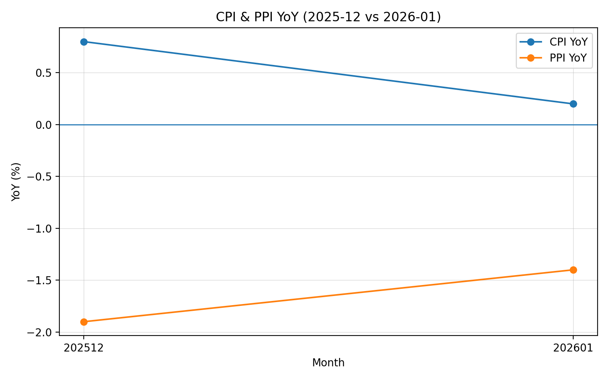

# 宏观流动性与利率跟踪系统

## 📌 项目简介

本项目构建了一套结构化的宏观与利率跟踪框架，围绕如下传导链条展开分析：

> 流动性 → 银行负债 → 利率曲线 → 信用扩张 → 宏观景气

通过整合货币市场高频数据、同业存单利差、国债收益率曲线以及月度宏观指标（社融、PMI、CPI、PPI），生成系统化 LaTeX 固收研究报告。

项目目标是模拟资产管理机构或卖方固收研究部门的研究流程，建立一套可持续迭代的宏观利率分析体系。

---

## 📄 完整研究报告

👉 [点击查看 PDF 报告](report.pdf)

---

## 📊 核心图表示例

### 1️⃣ DR001 vs DR007

---

### 2️⃣ 10Y 国债 vs DR007

---

### 3️⃣ 收益率曲线快照

---

### 4️⃣ NCD 利差变化

---

### 5️⃣ 社融结构拆分

---

### 6️⃣ MLF 净投放 vs 社融规模

---

### 7️⃣ PMI、CPI、PPI 变化

 

---

## 🧠 核心分析框架

### 1️⃣ 资金面层
- DR001
- DR007
- OMO 7天净投放
- MLF 净投放

用于识别短期流动性压力及政策对冲行为。

---

### 2️⃣ 银行负债层
- NCD AAA（3M / 6M / 1Y）
- NCD – DR007 利差

用于判断短端资金压力是否传导至银行中期负债端。

---

### 3️⃣ 利率曲线层
- 10Y – 1Y
- 10Y – 3M
- 曲线形态变化
- 长端 vs 短端资金利率分化

---

### 4️⃣ 信用扩张层
- 社会融资规模
- 人民币贷款
- 票据融资
- 企业债券发行

---

### 5️⃣ 宏观景气层
- PMI
- CPI
- PPI

---

## 📂 项目结构
REPORT/
│
├── data/ # 原始与处理后的数据
├── figures/ # 自动生成图表
├── src/ # 数据抓取与处理脚本
├── report.tex # LaTeX 研究报告主文件
├── report.pdf # 编译后的完整报告
├── README.md
---

## 🛠 报告编译方式

使用 XeLaTeX：xelatex report.tex
---

## 🔎 阶段样本（2025.12 – 2026.01）

阶段特征：

- 跨年资金扰动集中于7天期限
- OMO 净投放对冲短端冲击
- NCD 利差短暂收窄后修复
- 曲线阶段性走陡后回归平缓
- 社融显著放量但 PMI 回落
- 通胀维持低位

阶段判断：

> 短期流动性扰动 + 政策对冲修复 + 信用阶段性放量  
> 实体景气改善仍待验证

---

## 🚀 未来扩展

- 自动化数据更新（AkShare API）
- 定时生成研究报告
- 构建宏观利率监测指标体系
- 可视化仪表盘系统